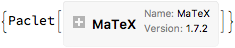
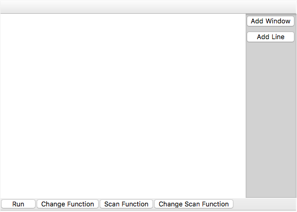
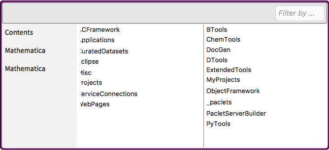
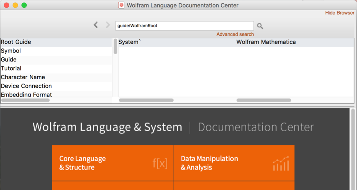
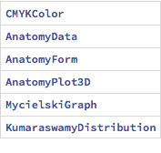
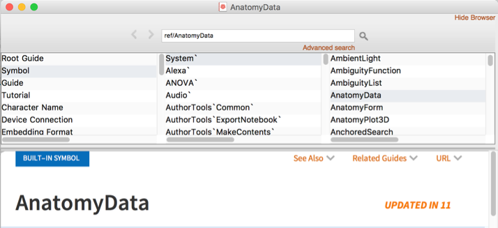

<a id="mathematica-tools" style="width:0;height:0;margin:0;padding:0;">&zwnj;</a>

# Mathematica Tools

This is a collection of basic Mathematica tools, generally implemented as one-off packages.

<a id="notebooktabbing" style="width:0;height:0;margin:0;padding:0;">&zwnj;</a>

## NotebookTabbing

This is a package that provides a tabbed notebook interface. Load it like so:

```mathematica
Get["https://raw.githubusercontent.com/b3m2a1/mathematica-tools/master/NotebookTabbing.wl"]
```

Here’s a sample usage:

```mathematica
test1=
CreateDocument[
  Cell[BoxData@ToBoxes@Unevaluated[TabNotebookCachePages@EvaluationNotebook[]],"Input"]
  ];
SetDockedTabs[test1,
Table[
i->i,
{i,3}
]];
```

An example can be found in  [Tabbing Example.nb](Tabbing Example.nb)

<a id="paclet-installation" style="width:0;height:0;margin:0;padding:0;">&zwnj;</a>

## Paclet Installation

This is functionality developed to put in my  [PackageData.net Service Connection](https://www.wolframcloud.com/objects/b3m2a1.paclets/PacletServer/serviceconnectionpackagedata.html) . It provides auto-installation of packages, especially from GitHub or the Wolfram Library Archive.

Load it like so:

```(*mathematica*)
Get["https://raw.githubusercontent.com/b3m2a1/mathematica-tools/master/PackageDataPacletInstall.m"]
```

Then use it like so:

```(*mathematica*)
PDInstallPaclet["https://github.com/szhorvat/MaTeX"]
```

	(*Out:*)
	
 

<a id="block-builder" style="width:0;height:0;margin:0;padding:0;">&zwnj;</a>

## Block Builder

This is a little block-programming interface, first introduced in this  [StackExchange answer](https://mathematica.stackexchange.com/a/154868/38205) . Load it like so:

```(*mathematica*)
Get["https://raw.githubusercontent.com/b3m2a1/mathematica-tools/master/BlockBuilder.m"]
```

And use it like this

```(*mathematica*)
BlockBuilder[]
```



<a id="file-browser" style="width:0;height:0;margin:0;padding:0;">&zwnj;</a>

## File Browser

This is a file browser, built kinda like the Finder on a Mac computer. A more sophisticated version is in BTools. Load it like so:

```(*mathematica*)
Get["https://raw.githubusercontent.com/b3m2a1/mathematica-tools/master/FileBrowser.wl"]
```

You can use it like so:

```(*mathematica*)
FileBrowser[Directory[]];
(*Loads a sidebar pre-populated with $HomeDirectory and friends*)
FileBrowser[Directory[],
 Function->Print
 ];
(*Prints files instead of opening them on double-click*)
FileBrowser[BTools`$AppDirectory,
 {$InstallationDirectory, $BaseDirectory, $UserBaseDirectory}
 ]
(*Loads a different root directory and sidebar*)
```

	(*Out:*)
	
 

<a id="oldhelpbrowser" style="width:0;height:0;margin:0;padding:0;">&zwnj;</a>

## OldHelpBrowser

Creates an old-style (pre-Version 6) help browser. Also includes a search function. Builds an index of all existing documentation pages. Load it like so:

```(*mathematica*)
Get["https://raw.githubusercontent.com/b3m2a1/mathematica-tools/master/OldHelpBrowser.wl"]
```

Then use it like so:

```(*mathematica*)
OpenHelpBrowser[CurrentValue[HomePage] (* Optional. Blank will open faster. *)]
```

	(*Out:*)
	
	NotebookObject[FrontEndObject[LinkObject["36tt4_shm", 3, 1]], 681]



It also implements documentation search:

```(*mathematica*)
HelpPagesSearch[
 {
  "type"->"Symbol",
  "title"->"*My*"
  },
 True
 ]
```

	(*Out:*)
	
 

Clicking on one of those links will open the standard browser

