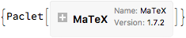

<a id="mathematica-tools" style="width:0;height:0;margin:0;padding:0;">&zwnj;</a>

# Mathematica Tools

This is a collection of basic Mathematica tools, generally implemented as one-off packages.

<a id="notebooktabbing" style="width:0;height:0;margin:0;padding:0;">&zwnj;</a>

## NotebookTabbing

This is a package that provides a tabbed notebook interface. Load it like so:

	Get["https://raw.githubusercontent.com/b3m2a1/mathematica-tools/\
	master/NotebookTabbing.wl"]

Here’s a sample usage:

	test1 =
	  CreateDocument[
	     Cell[
	    BoxData@ToBoxes@
	      Unevaluated[TabNotebookCachePages@EvaluationNotebook[]], "Input"]
	     ];
	SetDockedTabs[test1,
	  Table[
	   i -> i,
	   {i, 3}
	   ]];

An example can be found in  [Tabbing Example.nb](Tabbing Example.nb)

<a id="paclet-installation" style="width:0;height:0;margin:0;padding:0;">&zwnj;</a>

## Paclet Installation

This is functionality developed to put in my  [PackageData.net Service Connection](https://www.wolframcloud.com/objects/b3m2a1.paclets/PacletServer/serviceconnectionpackagedata.html) . It provides auto-installation of packages, especially from GitHub or the Wolfram Library Archive.

Load it like so:

	Get["https://raw.githubusercontent.com/b3m2a1/mathematica-tools/\
	master/PackageDataPacletInstall.m"]

Then use it like so:

	PDInstallPaclet["https://github.com/szhorvat/MaTeX"]

	(*Out:*)
	
 